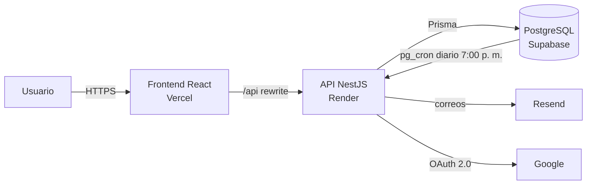

# FinancieraRiwi — Software de Liquidación de Nómina

Plataforma web que automatiza la liquidación de nómina mensual. Aplica las reglas de negocio de la empresa y la normativa laboral colombiana vigente. El primer cliente es **Financiera Riwi**, cuyo equipo de contabilidad hoy liquida la nómina a mano y comete errores frecuentes.

> **Proyecto formativo SENA · RIWI** — equipo **RiwiTech**.

## Problema

La liquidación manual genera errores en los valores pagados. Corregirlos crea trabajo adicional para el área contable y retrasa otras tareas.

Las causas raíz son dos:

- No existe un proceso estructurado para recibir la información de los colaboradores.
- El área contable no tiene herramientas para mantener al día los parámetros legales (salario mínimo, aportes, parafiscales).

Ver [Visión y alcance](docs/requerimientos/01-vision-y-alcance.md).

## Qué hace

- Importa colaboradores desde un archivo CSV, validando y reportando los errores fila por fila.
- Registra las horas trabajadas de cada colaborador por periodo.
- Calcula la nómina:
  - **Devengado:** horas × valor hora según el rol, bonificación por hijos y auxilio de transporte.
  - **Deducciones:** salud, pensión y Fondo de Solidaridad Pensional.
  - **Costo para el empleador:** aportes, parafiscales y provisiones.
- Ejecuta la liquidación **automáticamente el día 30 de cada mes a las 7:00 p. m.** (hora de Colombia), sin duplicados.
- Permite reliquidar y cerrar el periodo, con auditoría completa.
- Envía el desprendible a cada colaborador por correo y exporta los reportes a CSV y PDF.
- Inicio de sesión con correo y contraseña o con Google (JWT), con roles de **Administrador** y **Auxiliar contable**.

**Fuera de alcance (v1):** pago automático, nómina electrónica DIAN, PILA, retención en la fuente, horas extra y recargos.

## Arquitectura



| Capa | Tecnología |
|---|---|
| Frontend | React 19, Vite, TypeScript, React Router |
| Backend | NestJS 12, TypeScript, Prisma 7, class-validator, Swagger |
| Base de datos | PostgreSQL en Supabase (`pg_cron` + `pg_net` para la ejecución programada) |
| Autenticación | JWT (access de 15 min + refresh rotativo en cookie httpOnly), Google OAuth 2.0, bcrypt |
| Correo | Resend |
| Despliegue | Vercel (frontend), Render (backend) |
| Calidad | Vitest, Testing Library, Oxlint, Prettier, GitHub Actions |

Más detalle en [Arquitectura](docs/diseno/arquitectura.md) y en las [decisiones técnicas (ADR)](docs/decisiones/).

## Estructura del repositorio

```
├── backend/          API NestJS (módulos por dominio, Prisma, pruebas)
│   ├── prisma/       schema.prisma, seed y SQL de pg_cron
│   └── src/
├── frontend/         Aplicación React + Vite
├── docs/
│   ├── requerimientos/   Visión, RF, RNF, reglas de negocio, historias, casos de uso, trazabilidad
│   ├── diseno/           Arquitectura, modelo de datos, API, algoritmo, wireframes
│   ├── decisiones/       ADRs
│   ├── guias/            Configuración local y de servicios externos
│   └── proceso/          Roles, plan de trabajo, DoR/DoD, flujo en GitHub, actas
└── .github/          CI, plantillas de issues y PR, CODEOWNERS
```

## Cómo ejecutar en local

Requisitos: **Node.js 24** (`nvm use`), npm 10 o superior y un proyecto de Supabase (o un PostgreSQL local).

```bash
# 1. Backend
cd backend
cp .env.example .env          # completar DATABASE_URL, DIRECT_URL y los secretos
npm install                   # también genera el cliente de Prisma
npm run prisma:migrate        # crea las tablas
npm run prisma:seed           # parámetros 2026, valores hora y usuario administrador
npm run start:dev             # http://localhost:3000/api · Swagger en /api/docs

# 2. Frontend (otra terminal)
cd frontend
cp .env.example .env
npm install
npm run dev                   # http://localhost:5173
```

Guía completa: [Configuración local](docs/guias/configuracion-local.md) · [Servicios externos (Supabase, Google, Resend, Render, Vercel)](docs/guias/configuracion-servicios.md).

### Scripts principales

| Comando | Backend | Frontend |
|---|---|---|
| `npm run start:dev` / `npm run dev` | API en modo desarrollo | App en modo desarrollo |
| `npm test` | Pruebas unitarias | Pruebas de componentes |
| `npm run test:e2e` | Pruebas e2e de la API | — |
| `npm run lint` | Oxlint | Oxlint |
| `npm run build` | Compila a `dist/` | Compila a `dist/` |

## Documentación

| Documento | Descripción |
|---|---|
| [Índice de documentación](docs/README.md) | Punto de entrada |
| [Requerimientos](docs/requerimientos/) | Toma de requerimientos completa |
| [Historias de usuario](docs/requerimientos/05-historias-de-usuario.md) | Backlog con criterios de aceptación |
| [Reglas de negocio](docs/requerimientos/04-reglas-de-negocio.md) | Fórmulas y casos de prueba |
| [Plan de trabajo](docs/proceso/plan-de-trabajo.md) | Sprints, ceremonias y entregables |
| [Reglas de trabajo](CONTRIBUTING.md) | Ramas, commits, PRs y revisiones |

## Gestión del proyecto

- **Tablero:** GitHub Projects → *FinancieraRiwi — Software de Nómina* (pestaña **Projects** del repositorio).
- **Backlog:** épicas E0–E8, historias HU-01 a HU-26 y tareas T-01 a T-21, gestionadas como issues.
- **Metodología:** Scrum con sprints de una semana alineados a las sesiones de martes y jueves.

## Equipo

| Integrante | Rol |
|---|---|
| [@DylanSrz](https://github.com/DylanSrz) | Product Owner · Tech Lead · Backend |
| [@Nesdael](https://github.com/Nesdael) | Scrum Master · QA · Backend |
| [@Kerin0011](https://github.com/Kerin0011) | Analista de requerimientos · BD/DevOps · Backend |
| [@Gonza204658](https://github.com/Gonza204658) | Frontend lead · UX |

Detalle en [Roles y responsabilidades](docs/proceso/roles-y-responsabilidades.md).

---

RiwiTech · versión 0.1.0 (Sprint 0)
