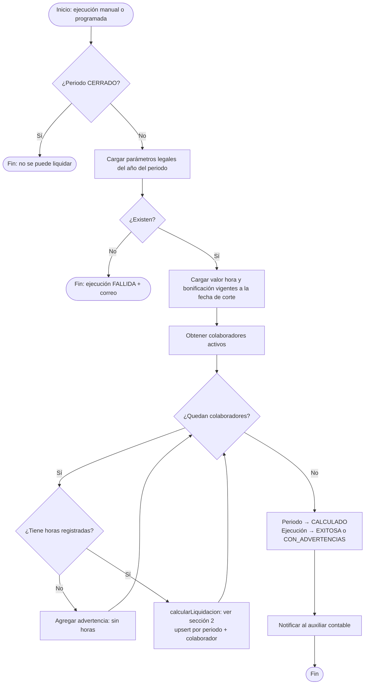
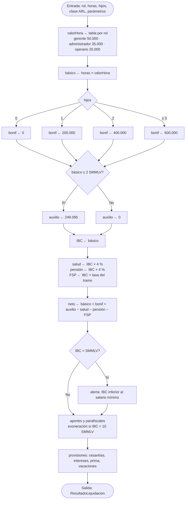

# Algoritmo de liquidación

Este documento completa la sección "Algoritmo" del documento inicial, que había quedado inconclusa:

> *1. Inicio 2. colaborador se registra 3. si rol es gerente o admin 4. Fin*

Se implementa en `backend/src/liquidacion/domain/calculadora-nomina.ts` como una **función pura**: no consulta la base de datos ni el reloj del sistema. Las reglas están en [04-reglas-de-negocio.md](../requerimientos/04-reglas-de-negocio.md).

## 1. Proceso completo de una ejecución



## 2. Cálculo por colaborador



## 3. Pseudocódigo

```text
FUNCIÓN calcularLiquidacion(entrada, p) → resultado
    valorHora   ← p.valorHora[entrada.rol]
    básico      ← entrada.horas × valorHora                                   // RN-01..03, RN-07
    bonif       ← SI entrada.hijos = 0 ENTONCES 0
                  SINO p.bonificacionHijos[MIN(entrada.hijos, 3)]             // RN-04..06
    auxilio     ← SI básico ≤ p.topeAuxilioSmmlv × p.smmlv
                  ENTONCES p.auxilioTransporte SINO 0                          // RN-09
    totalDev    ← básico + bonif + auxilio

    ibc         ← básico                                                      // supuesto S-03
    salud       ← redondear(ibc × p.saludEmpleado)                            // RN-10
    pensión     ← redondear(ibc × p.pensionEmpleado)                          // RN-11
    tramo       ← tramo de p.fspTramos donde desde ≤ ibc / p.smmlv < hasta
    fsp         ← SI tramo existe ENTONCES redondear(ibc × tramo.tasa) SINO 0 // RN-12
    deducciones ← salud + pensión + fsp
    neto        ← totalDev − deducciones                                       // RN-13

    exonerado   ← ibc < p.topeExoneracionSmmlv × p.smmlv                       // art. 114-1 E.T.
    saludEmp    ← SI exonerado ENTONCES 0 SINO redondear(ibc × p.saludEmpleador)
    pensiónEmp  ← redondear(ibc × p.pensionEmpleador)
    arl         ← redondear(ibc × p.arlTarifas[entrada.claseRiesgoArl])
    caja        ← redondear(ibc × p.cajaCompensacion)
    icbf        ← SI exonerado ENTONCES 0 SINO redondear(ibc × p.icbf)
    sena        ← SI exonerado ENTONCES 0 SINO redondear(ibc × p.sena)

    basePrest   ← básico + auxilio
    cesantías   ← redondear(basePrest / 12)
    intereses   ← redondear(basePrest / 12 × 0,12)
    prima       ← redondear(basePrest / 12)
    vacaciones  ← redondear(básico / 24)                                       // RN-14
    costo       ← totalDev + saludEmp + pensiónEmp + arl + caja + icbf + sena
                  + cesantías + intereses + prima + vacaciones

    alertas     ← SI ibc < p.smmlv ENTONCES ["IBC inferior al salario mínimo"] SINO []
    RETORNAR todos los conceptos + alertas
FIN

redondear(x) = piso(x + 0,5)    // al peso, mitades hacia arriba
```

## 4. Ejemplo resuelto (CP-01)

Operario, 168 horas, 2 hijos, ARL clase I, parámetros de 2026:

| Paso | Cálculo | Valor |
|---|---|---|
| Básico | 168 × 20.000 | 3.360.000 |
| Bonificación | 2 hijos | 400.000 |
| Auxilio | 3.360.000 ≤ 3.501.810 | 249.095 |
| **Total devengado** | | **4.009.095** |
| Salud | 3.360.000 × 4 % | 134.400 |
| Pensión | 3.360.000 × 4 % | 134.400 |
| FSP | 3.360.000 / 1.750.905 = 1,92 SMMLV < 4 | 0 |
| **Neto a pagar** | 4.009.095 − 268.800 | **3.740.295** |
| Pensión empleador | 3.360.000 × 12 % | 403.200 |
| ARL | 3.360.000 × 0,522 % | 17.539 |
| Caja | 3.360.000 × 4 % | 134.400 |
| Salud empleador, ICBF y SENA | Exonerados (< 10 SMMLV) | 0 |
| Cesantías | 3.609.095 / 12 | 300.758 |
| Intereses | 300.757,92 × 12 % | 36.091 |
| Prima | 3.609.095 / 12 | 300.758 |
| Vacaciones | 3.360.000 / 24 | 140.000 |
| **Costo empleador** | 4.009.095 + 1.332.746 | **5.341.841** |
