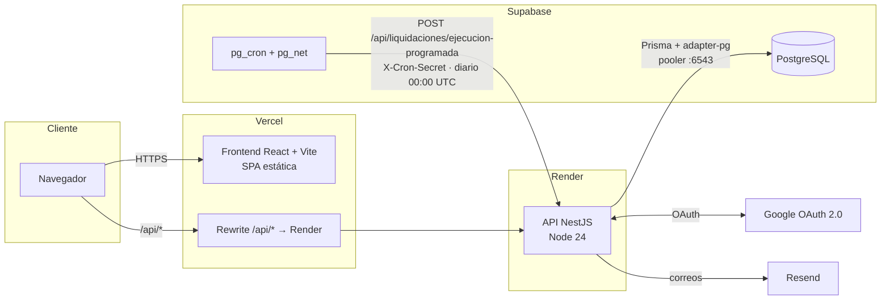
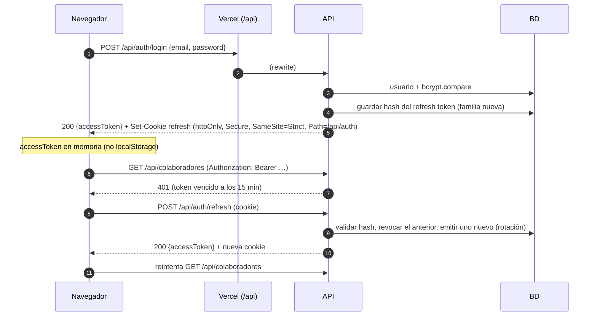
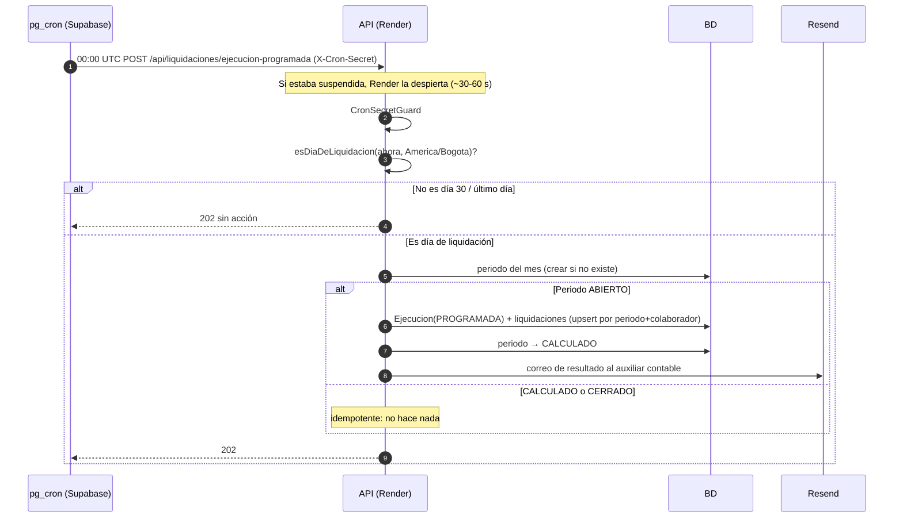

# Arquitectura

## Vista general



**Decisiones clave:**

- **Mismo origen gracias al rewrite de Vercel:** el navegador solo habla con el dominio de Vercel, y Vercel reenvía `/api/*` a Render. Así la cookie del refresh token es *first-party* (`SameSite=Strict`) y no hay problemas de CORS ni de bloqueo de cookies de terceros (ADR-004, ADR-008).
- **Disparador externo:** el plan gratuito de Render suspende el servicio cuando está inactivo, así que un cron interno no se ejecutaría a tiempo. Por eso `pg_cron` en Supabase llama a la API todos los días y la despierta (ADR-007).
- **Motor puro:** el cálculo de nómina es una función pura, sin base de datos ni reloj del sistema. Se prueba con los casos CP-01 a CP-12.

## Backend: módulos

```
backend/src
├── main.ts / configurar-app.ts   Arranque: prefijo /api, Helmet, CORS, cookies, ValidationPipe, Swagger
├── config/                       Validación de variables de entorno (zod)
├── prisma/                       PrismaService (cliente global)
├── common/                       Decoradores (@Public, @Roles, @UsuarioActual), RolesGuard
├── auth/                         Login, Google, JWT, refresh, recuperación          (E1)
├── usuarios/                     Invitaciones y gestión de usuarios                  (E1)
├── colaboradores/                CRUD e importación CSV                              (E2)
├── horas/                        Horas por periodo                                   (E3)
├── liquidacion/
│   ├── domain/                   Motor puro: tipos, parámetros 2026, calculadora     (E4)
│   └── liquidacion.controller    Periodos: liquidar, reliquidar, cerrar              (E5)
├── ejecucion-programada/         Endpoint del cron, guard de secreto, calendario     (E5)
├── parametros/                   Parámetros legales y valores hora                   (E6)
├── reportes/                     Resumen, exportación, desprendibles                 (E7)
├── mail/                         MailService (Resend)                                (E7)
├── auditoria/                    AuditoriaService y consulta                         (RNF-07)
└── health/                       GET /api/health                                     (Render)
```

**Guards globales**, en este orden:

1. `ThrottlerGuard`: límite de peticiones.
2. `JwtAuthGuard`: todo es privado salvo lo marcado con `@Public()`.
3. `RolesGuard`: aplica `@Roles('ADMIN')`.

## Frontend: estructura

```
frontend/src
├── app/router.tsx         Rutas públicas (login, activar, recuperar) y privadas (RequireAuth)
├── auth/                  AuthProvider, useAuth, RequireAuth (por rol)
├── lib/api.ts             Cliente HTTP: Bearer token en memoria + refresh automático en 401
├── layouts/               AppLayout (menú lateral), AuthLayout
├── pages/                 Una página por pantalla de los wireframes
├── components/            Componentes reutilizables
└── styles/global.css      Variables de diseño y estilos base
```

## Flujo de autenticación



- **Reutilización de un refresh token revocado:** se revoca toda la familia de tokens, porque indica un posible robo.
- **Login con Google:**
  1. `GET /api/auth/google` redirige al consentimiento de Google.
  2. Google regresa a `/api/auth/google/callback`.
  3. La API verifica que el correo esté invitado.
  4. La API emite la cookie de refresh y redirige a `FRONTEND_URL/`.
  5. El frontend llama a `/auth/refresh` y obtiene el access token.

## Flujo de la ejecución programada



## Entornos

| Entorno | Frontend | API | Base de datos |
|---|---|---|---|
| Local | `localhost:5173` (proxy `/api` → `:3000`) | `localhost:3000` | Proyecto Supabase de desarrollo o PostgreSQL local |
| Producción | `https://<proyecto>.vercel.app` | `https://financiera-riwi-api.onrender.com` (detrás del rewrite) | Proyecto Supabase de producción |

Las variables de entorno están en `backend/.env.example` y `frontend/.env.example`. La configuración de servicios está en [configuracion-servicios.md](../guias/configuracion-servicios.md).
