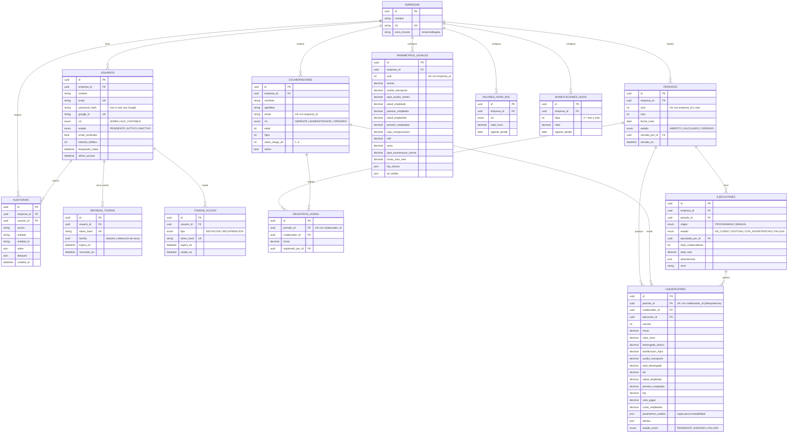

# Modelo de datos

La fuente de verdad es [`backend/prisma/schema.prisma`](../../backend/prisma/schema.prisma); este documento lo explica. **Todo cambio al schema actualiza este ERD en el mismo PR.**

**Convenciones:**

- Tablas en `snake_case` plural.
- Llaves primarias UUID.
- Montos en `DECIMAL(14,2)`.
- Porcentajes en `DECIMAL(7,5)` (0,04 = 4 %).
- Fechas en UTC.
- Todo cuelga de `empresa_id`, para que el sistema sea multiempresa (ADR-005).

## Diagrama entidad-relación

> En el diagrama, `LIQUIDACIONES` muestra solo las columnas principales. El schema también incluye las columnas de aportes del empleador, parafiscales y provisiones: `salud_empleador`, `pension_empleador`, `arl`, `caja_compensacion`, `icbf`, `sena`, `cesantias`, `intereses_cesantias`, `prima` y `vacaciones`.

## Restricciones importantes

| Restricción | Regla |
|---|---|
| `colaboradores (empresa_id, email)` único | RN-19: email único por empresa |
| `periodos (empresa_id, anio, mes)` único | Un periodo por mes |
| `registros_horas (periodo_id, colaborador_id)` único | Un registro de horas por colaborador y periodo |
| `liquidaciones (periodo_id, colaborador_id)` único | **RN-17: idempotencia**, no hay liquidaciones duplicadas |
| `parametros_legales (empresa_id, anio)` único | RN-16: un juego de parámetros por año |
| `valores_hora_rol (empresa_id, rol, vigente_desde)` único | RN-16: histórico de valores hora |
| `liquidaciones.parametros_usados` | RN-16/18: cambiar parámetros después no altera periodos ya calculados |
| Tokens (`refresh_tokens`, `tokens_accion`) | Solo se guarda el hash, nunca el token en claro |

## Datos iniciales (seed)

`npm run prisma:seed` crea:

- la empresa *Financiera Riwi*;
- los parámetros legales de 2026;
- los valores hora de los 3 roles;
- la tabla de bonificación por hijos;
- el usuario administrador (definido con `SEED_ADMIN_EMAIL` y `SEED_ADMIN_PASSWORD`).

Ver [`backend/prisma/seed.ts`](../../backend/prisma/seed.ts).
