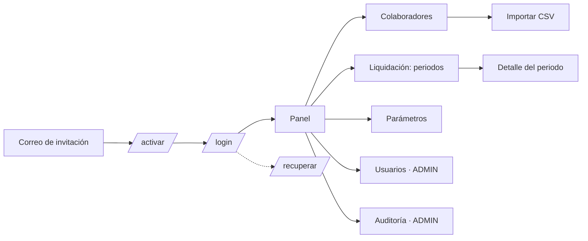

# Wireframes (baja fidelidad)

Bocetos para validar el flujo con el cliente antes de diseñar en alta fidelidad. Cada pantalla indica las historias que cubre. Las rutas coinciden con `frontend/src/app/router.tsx`.

## Mapa de navegación



## 1. Iniciar sesión — `/login` (HU-02, HU-03)

```
┌──────────────────────────────────────────┐
│              Nómina Riwi                 │
│                                          │
│  Iniciar sesión                          │
│  Correo      [________________________]  │
│  Contraseña  [________________________]  │
│  ⚠ Correo o contraseña incorrectos       │
│                                          │
│  [          Ingresar                  ]  │
│  [ G   Continuar con Google           ]  │
│                                          │
│  ¿Olvidaste tu contraseña?               │
└──────────────────────────────────────────┘
```

## 2. Activar cuenta — `/activar?token=…` (HU-01)

```
┌──────────────────────────────────────────┐
│  Hola, Laura. Define tu contraseña       │
│  Contraseña          [________________]  │
│  Confirmar           [________________]  │
│  ✓ 8+ caracteres  ✓ 1 mayúscula  ✗ 1 nº  │
│  [        Activar cuenta              ]  │
└──────────────────────────────────────────┘
```

## 3. Panel — `/` (HU-23, HU-20)

```
┌────────────┬──────────────────────────────────────────────────────────┐
│ Nómina Riwi│  Panel                                                    │
│            │                                                           │
│ ▸ Panel    │  ┌─ Periodo octubre 2026 ─┐ ┌─ Próxima ejecución ───────┐│
│   Colabor. │  │ Estado: ABIERTO        │ │ jue 30 oct · 7:00 p. m.   ││
│   Liquidac.│  │ Horas: 42/45 colab.    │ │ (automática)              ││
│   Parámetr.│  └────────────────────────┘ └───────────────────────────┘│
│   Usuarios │  ┌─ Último periodo cerrado (septiembre) ─────────────────┐│
│   Auditoría│  │ Neto pagado $ 182.430.000 · Costo empresa $ 251.900.000││
│            │  └────────────────────────────────────────────────────────┘│
│ aux@…      │  ⚠ 3 colaboradores sin horas registradas en octubre       │
│ [Salir]    │                                                           │
└────────────┴──────────────────────────────────────────────────────────┘
```

## 4. Colaboradores — `/colaboradores` (HU-09, HU-10)

```
Colaboradores                                  [⬆ Importar CSV] [+ Nuevo]
Buscar [______________]  Rol [Todos ▾]  Estado [Activos ▾]

│ Nombre               │ Rol           │ Email                  │ Hijos │      │
│ Ana María Pérez      │ Operario      │ ana.perez@…            │   2   │ ✎ ⊘ │
│ Carlos Rodríguez     │ Gerente       │ carlos.rodriguez@…     │   0   │ ✎ ⊘ │
│ Luisa F. Martínez    │ Administrador │ luisa.martinez@…       │   3   │ ✎ ⊘ │
                                                      ‹ 1 2 3 ›  20 por página
```

## 5. Importar CSV — `/colaboradores/importar` (HU-07, HU-08)

```
Importar colaboradores                       [Descargar plantilla CSV]

Paso 1  ┌ ─ ─ ─ ─ ─ ─ ─ ─ ─ ─ ─ ─ ─ ─ ─ ─ ─ ─ ─ ┐
        │  Arrastra el archivo .csv aquí (máx 5 MB) │
        └ ─ ─ ─ ─ ─ ─ ─ ─ ─ ─ ─ ─ ─ ─ ─ ─ ─ ─ ─ ┘
Paso 2  Vista previa: ✅ 48 válidas   ❌ 2 con errores
        │ Fila │ Email              │ Error                        │
        │  7   │ jorge@…            │ Rol no válido ("supervisor") │
        │  12  │ (vacío)            │ Email no válido              │
        [Descargar errores]
Paso 3  [ Cancelar ]                      [ Importar 48 colaboradores ]
```

## 6. Liquidación — `/periodos` (HU-17, HU-18, HU-19)

```
Liquidación
│ Periodo        │ Estado     │ Colab. │ Neto total     │ Ejecución          │           │
│ Octubre 2026   │ ABIERTO    │   —    │       —        │ Programada 30/10   │ [Liquidar]│
│ Septiembre 2026│ CERRADO 🔒 │   45   │ $ 182.430.000  │ Programada · ✅    │ [Ver]     │
│ Agosto 2026    │ CERRADO 🔒 │   44   │ $ 179.950.000  │ Manual · ✅        │ [Ver]     │
```

## 7. Detalle del periodo — `/periodos/:id` (HU-11, HU-23, HU-24, HU-25)

```
Octubre 2026 · CALCULADO          [Reliquidar] [Cerrar periodo] [Exportar ▾]
[ Horas ] [ Liquidación ] [ Ejecuciones ]

Totales: Devengado $ 201.3 M · Deducciones $ 14.1 M · Neto $ 187.2 M · Costo $ 259.8 M
⚠ 1 alerta: Jorge Ramírez — IBC inferior al salario mínimo

│ Colaborador   │ Horas │ Básico     │ Bonif.  │ Auxilio │ Salud   │ Pensión │ Neto       │
│ Ana M. Pérez  │  168  │ 3.360.000  │ 400.000 │ 249.095 │ 134.400 │ 134.400 │ 3.740.295  │
│ Carlos Rodríg.│  160  │ 8.000.000  │       0 │       0 │ 320.000 │ 320.000 │ 7.280.000  │
  (clic en una fila → detalle con todos los conceptos y costo empleador)

Tras cerrar:  [✉ Enviar desprendibles a 45 colaboradores]
```

## 8. Parámetros — `/parametros` (HU-21, HU-22)

```
Parámetros                                         Año [2026 ▾] [+ Nuevo año]
┌ Legales 2026 ───────────────────────────┐ ┌ Valor hora por rol ────────────┐
│ SMMLV                 $ 1.750.905       │ │ Gerente        $ 50.000 desde 01/01│
│ Auxilio transporte    $   249.095       │ │ Administrador  $ 35.000 desde 01/01│
│ Salud emp. 4 % · Pensión emp. 4 %       │ │ Operario       $ 20.000 desde 01/01│
│ Salud empl. 8,5 % · Pensión empl. 12 %  │ │ [+ Nuevo valor con vigencia]       │
│ Caja 4 % · ICBF 3 % · SENA 2 %          │ ├ Bonificación por hijos ───────────┤
│ Máx. horas/mes 180                      │ │ 1 → $200.000 · 2 → $400.000 · 3+ → $600.000│
│ [Editar] (solo ADMIN)                   │ └────────────────────────────────────┘
└─────────────────────────────────────────┘
```

## 9. Usuarios — `/usuarios` (HU-01, HU-06) · solo ADMIN

```
Usuarios                                                  [+ Invitar usuario]
│ Nombre        │ Email                │ Rol          │ Estado    │ Último acceso │      │
│ Laura Gómez   │ laura.gomez@…        │ AUX_CONTABLE │ ACTIVO    │ hoy 9:12      │ ✎ ⊘ │
│ Pedro Ruiz    │ pedro.ruiz@…         │ AUX_CONTABLE │ PENDIENTE │ —             │ ↻   │
```

## 10. Desprendible por correo (HU-25)

```
De: Nómina Riwi · Asunto: Tu desprendible de nómina — Octubre 2026
Hola Ana María,
  Devengado básico (168 h × $20.000)   $ 3.360.000
  Bonificación por hijos (2)           $   400.000
  Auxilio de transporte                $   249.095
  Salud (4 %)                         -$   134.400
  Pensión (4 %)                       -$   134.400
  ─────────────────────────────────────────────────
  Neto a pagar                         $ 3.740.295
```
