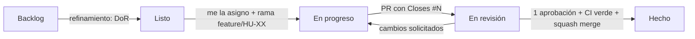

# Flujo de trabajo en GitHub

## Tablero: GitHub Projects

Proyecto: **FinancieraRiwi — Software de Nómina**. Está vinculado al repositorio y se abre desde la pestaña **Projects**.

### Columnas (campo *Status*)

| Estado | Significado | Quién lo mueve |
|---|---|---|
| **Backlog** | Identificado, falta refinar | PO |
| **Listo** | Cumple la Definition of Ready; puede tomarse en el sprint actual | PO / SM |
| **En progreso** | Alguien trabaja en él (máximo 2 por persona) | Responsable |
| **En revisión** | PR abierto esperando aprobación | Responsable |
| **Hecho** | Cumple la Definition of Done (se mueve solo al integrar el PR) | Automático |

### Campos personalizados

| Campo | Tipo | Valores |
|---|---|---|
| Prioridad | Selección | Must · Should · Could · Won't |
| Story Points | Número | 1, 2, 3, 5, 8 |
| Sprint | Selección | Sprint 0 · 1 · 2 · 3 |
| Épica | Selección | E0 a E8 |
| Tipo | Selección | Épica · Historia · Tarea · Bug · Spike |
| Inicio / Fin | Fecha | Fechas del sprint (para la vista Roadmap) |

### Vistas recomendadas

| Vista | Diseño | Configuración |
|---|---|---|
| **Tablero** | Board | Agrupar por *Status*; filtro `-tipo:Épica` |
| **Sprint actual** | Table | Filtro `sprint:"Sprint 1"`; agrupar por *Responsable*; mostrar *Story Points* con suma |
| **Backlog por épica** | Table | Agrupar por *Épica*; ordenar por *Prioridad* |
| **Roadmap** | Roadmap | Fechas *Inicio* → *Fin*; agrupar por *Sprint* |

### Automatizaciones (Project → ⋯ → Workflows)

- *Item added to project* → Status: **Backlog**
- *Item closed* → Status: **Hecho**
- *Pull request merged* → Status: **Hecho**
- *Auto-add to project*: filtro `is:issue,pr is:open` del repositorio

## Etiquetas

| Grupo | Etiquetas |
|---|---|
| Tipo | `tipo: epica`, `tipo: historia`, `tipo: tarea`, `tipo: bug`, `tipo: docs`, `tipo: spike` |
| Área | `area: backend`, `area: frontend`, `area: bd`, `area: devops`, `area: auth`, `area: requerimientos` |
| Estado | `bloqueado` |

## Jerarquía de issues

```
Épica (tipo: epica)                    [E4] Motor de liquidación  (#5)
 └── Historia (sub-issue)              [HU-12] Calcular el devengado básico  (#21)
      └── Tarea técnica (opcional)     Checklist dentro del issue o sub-issue
```

- **Milestones:** uno por sprint (*Sprint 0* a *Sprint 3*), con la fecha de cierre.
- **Sub-issues:** las épicas muestran el avance de sus historias.

## Ciclo de vida de una historia



## Protección de `main` (ruleset)

- Pull request obligatorio con 1 aprobación; las aprobaciones se descartan si llegan nuevos commits.
- Checks obligatorios: `Backend` y `Frontend` (GitHub Actions).
- Conversaciones resueltas antes de integrar; solo *squash merge*.
- Sin force-push ni borrado de la rama.
