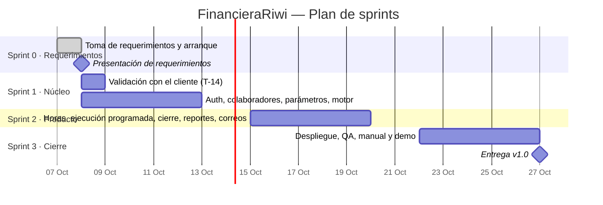

# Plan de trabajo

- **Metodología:** Scrum adaptado. Sprints de **1 semana**, de jueves a martes, alineados a las sesiones de clase (martes y jueves, 1:00 a 4:00 p. m.). Entre clases se trabaja de forma asíncrona sobre los issues.
- **Fecha objetivo de la versión 1.0:** martes 27 de octubre de 2026.

## Cronograma

| Sprint | Fechas | Objetivo del sprint | Entregable | Historias / tareas |
|---|---|---|---|---|
| **Sprint 0** | 7 – 8 oct | Requerimientos completos, trazables y validables; repositorio y tablero listos | Paquete de requerimientos + repositorio estructurado | T-01 a T-13 |
| **Sprint 1** | 8 – 13 oct | Validar los supuestos con el cliente; acceso seguro; colaboradores; parámetros; motor de liquidación probado | API con login, CSV y motor CP-01 a CP-11 en verde | T-14 a T-16, HU-01–03, 05–10, 12–15, 21, 22 |
| **Sprint 2** | 15 – 20 oct | Ciclo completo de nómina de punta a punta | MVP: horas → liquidación automática → cierre → reportes → correos | T-17, HU-04, 11, 16–20, 23, 25, 26 |
| **Sprint 3** | 22 – 27 oct | Producto desplegado, probado y documentado | Release v1.0 en Vercel + Render + Supabase, manual y demo | T-18 a T-21, HU-24 |

## Ceremonias

| Ceremonia | Cuándo | Duración | Participantes | Resultado |
|---|---|---|---|---|
| **Sprint Planning** | Jueves 1:00 p. m. (inicio de sprint) | 30 min | Todo el equipo | Objetivo del sprint; issues en *Listo* con responsable |
| **Daily** | Inicio de cada clase | 10 min | Todo el equipo | Bloqueos visibles en el tablero |
| **Refinamiento** | Martes 2:30 p. m. | 20 min | PO + equipo | Historias del próximo sprint con DoR cumplida |
| **Sprint Review** | Martes 3:15 p. m. (fin de sprint) | 25 min | Equipo + instructor | Demo de lo terminado; historias aceptadas o devueltas |
| **Retrospectiva** | Martes 3:40 p. m. | 20 min | Equipo | 1 o 2 acciones de mejora concretas en el acta |

## Entregables por sprint

- Historias en estado **Hecho**, que cumplen la [Definition of Done](definicion-de-listo-y-terminado.md).
- Un acta por sesión en `docs/proceso/actas/`.
- Documentación y [matriz de trazabilidad](../requerimientos/09-matriz-trazabilidad.md) actualizadas.
- Un tag de versión al final del sprint (`v0.1.0` en Sprint 1, `v0.2.0` en Sprint 2, `v1.0.0` en Sprint 3).

## Riesgos

| Riesgo | Probabilidad | Impacto | Mitigación | Responsable |
|---|---|---|---|---|
| El cliente cambia reglas tras la entrevista | Media | Alto | Supuestos explícitos (S-01 a S-15) y parámetros configurables (ADR-006) | PO |
| Pocas horas de clase sincrónicas | Alta | Medio | Trabajo asíncrono por issues; PRs pequeños; revisión en menos de 24 h | SM |
| Errores en el cálculo legal | Media | Alto | Casos de prueba con valores exactos; motor puro con pruebas obligatorias | PO + QA |
| El plan gratuito de Render suspende el servicio | Alta | Medio | pg_cron despierta la API; timeout de 60 s (ADR-007) | DevOps |
| Problemas de configuración de OAuth o correo | Media | Medio | Guía paso a paso; tareas T-15 y T-16 al inicio del Sprint 1 | DevOps |
| Dependencia de una sola persona en un módulo | Media | Medio | Revisiones cruzadas; documentación en el repositorio | SM |
