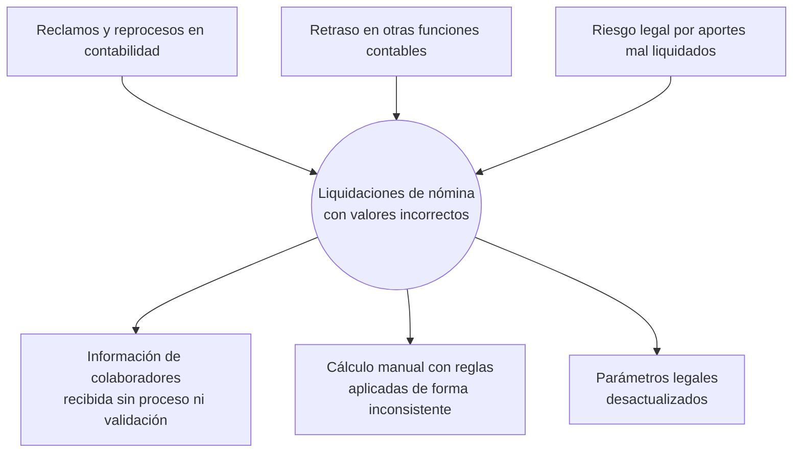

# 01 · Visión y alcance

| | |
|---|---|
| **Proyecto** | Software de liquidación de nómina |
| **Cliente** | Financiera Riwi (primer cliente) |
| **Proveedor** | RiwiTech |
| **Versión del documento** | 1.0 — Sprint 0 (7 de octubre de 2026) |
| **Responsable** | Product Owner (@DylanSrz) |
| **Fuente** | [00-toma-inicial.md](00-toma-inicial.md) y sesiones de levantamiento del equipo |

## 1. Contexto

RiwiTech desarrolla software para que otras empresas automaticen la liquidación de su nómina. Su primer cliente es **Financiera Riwi**. Hoy su área de contabilidad liquida la nómina en hojas de cálculo, con datos que recoge de manera informal.

## 2. Problema

> La mayoría de las liquidaciones de nómina de Financiera Riwi salen con valores incorrectos para los colaboradores.

| Aspecto | Descripción |
|---|---|
| **Síntoma** | Valores mal pagados: rol equivocado, hijos sin contar, auxilio de transporte omitido, deducciones mal calculadas. |
| **Consecuencia** | Contabilidad dedica tiempo a resolver reclamos y reliquidar, y retrasa sus demás funciones. Además, la empresa corre el riesgo legal de pagar mal los aportes. |
| **Causa raíz 1** | No existe un proceso estructurado para recibir la información de los colaboradores que afecta la liquidación (rol, número de hijos, horas trabajadas). |
| **Causa raíz 2** | El área contable no tiene herramientas tecnológicas para mantener al día los valores legales (salario mínimo, auxilio de transporte, aportes y parafiscales), que cambian cada año. |

### Árbol del problema

## 3. Objetivo general

Automatizar la liquidación mensual de la nómina de Financiera Riwi, aplicando sin excepciones las reglas de la empresa y la normativa laboral colombiana vigente, para eliminar los errores de cálculo y la carga operativa de corregirlos.

## 4. Objetivos específicos y metas medibles

| # | Objetivo | Indicador | Meta |
|---|---|---|---|
| OE-1 | Eliminar los errores de cálculo | % de liquidaciones que coinciden con los casos de prueba validados | 100 % |
| OE-2 | Estandarizar la entrada de información | % de colaboradores cargados por CSV o formulario con validación | 100 % |
| OE-3 | Ejecutar la liquidación sin intervención humana | Ejecuciones automáticas a tiempo el día 30 (o el último día del mes) a las 7:00 p. m. | 12 de 12 al año |
| OE-4 | Mantener los parámetros legales al día sin programar | Tiempo para actualizar el SMMLV o un porcentaje | < 1 minuto, sin desplegar |
| OE-5 | Reducir el tiempo de liquidación | Tiempo de contabilidad por ciclo de nómina | De días a < 1 hora de revisión |
| OE-6 | Dar trazabilidad | Acciones críticas registradas en auditoría | 100 % |

## 5. Interesados (stakeholders)

| Interesado | Rol en el sistema | Interés / necesidad | Influencia |
|---|---|---|---|
| Auxiliar contable de Financiera Riwi | Usuario principal (`AUX_CONTABLE`) | Liquidar rápido y sin errores, y responder reclamos con evidencia | Alta |
| Jefe de contabilidad / Administrador | Administrador (`ADMIN`) | Controlar accesos, parámetros y auditoría | Alta |
| Colaboradores de Financiera Riwi | Reciben el desprendible por correo | Recibir el pago correcto y entender cómo se calculó | Media |
| Gerencia de Financiera Riwi | Patrocinador | Reducir costos operativos y riesgo legal | Alta |
| RiwiTech (equipo de desarrollo) | Proveedor | Entregar un producto replicable para otras empresas | Alta |
| Instructor SENA / RIWI | Evaluador y cliente simulado | Calidad del proceso de requerimientos y del producto | Alta |

## 6. Alcance del producto (v1.0)

### Dentro del alcance

1. **Acceso seguro:**
   - Usuarios invitados por un administrador.
   - Inicio de sesión con correo y contraseña o con Google.
   - Sesiones con JWT y roles `ADMIN` y `AUX_CONTABLE`.
   - Recuperación de contraseña.
2. **Colaboradores:**
   - Importación desde CSV (nombres, apellidos, rol, email, edad, hijos), con validación y reporte de errores por fila.
   - Creación, edición, desactivación y búsqueda.
3. **Horas trabajadas** por colaborador y periodo, registradas a mano o por CSV.
4. **Motor de liquidación:**
   - Reglas de la empresa: valor hora por rol y bonificación por hijos.
   - Normativa 2026: auxilio de transporte; salud, pensión y FSP del colaborador; aportes del empleador, parafiscales y provisiones de prestaciones.
5. **Ejecución automática** el día 30 de cada mes a las 7:00 p. m. (último día si el mes es más corto), idempotente y con notificación por correo.
6. **Liquidación manual y reliquidación** antes del cierre; **cierre del periodo**, que lo deja inmutable.
7. **Parámetros configurables:** valores legales por año, valor hora por rol y bonificación por hijos, todos con vigencia.
8. **Reportes:** resumen del periodo, exportación a CSV y PDF, y desprendible por correo para cada colaborador.
9. **Auditoría** de acciones y ejecuciones.

### Fuera del alcance (v1.0)

| Elemento | Motivo |
|---|---|
| Pago automático del valor devengado (transferencias) | Definido así por el cliente en el documento inicial |
| Nómina electrónica DIAN y planilla PILA | Requieren habilitación ante terceros; se evalúan para v2 |
| Retención en la fuente | Requiere depuración tributaria por colaborador; v2 |
| Horas extra, recargos nocturnos, dominicales y festivos | No están en las reglas entregadas; v2 (supuesto S-10) |
| Liquidación de contrato (finiquito), incapacidades y licencias | Fuera de las reglas entregadas |
| Portal de autoservicio del colaborador | Supuesto S-08: en v1 el colaborador solo recibe su desprendible |
| Multiempresa (SaaS) completo | El modelo de datos ya lo soporta (ADR-005); el registro de nuevas empresas es v2 |

## 7. Restricciones

- **Ejecución automática:** se calcula cada día 30 del mes a las 7:00 p. m., en la zona horaria `America/Bogota`.
- **Datos personales:** se tratan conforme a la Ley 1581 de 2012 (habeas data).
- **Tecnología:**
  - Backend en NestJS y frontend en React.
  - Base de datos PostgreSQL en Supabase.
  - Despliegue en Render y Vercel.
  - Correos con Resend.
- **Calendario:** el equipo es de 4 personas, con sesiones los martes y jueves de 1:00 a 4:00 p. m. La entrega v1.0 es el 27 de octubre de 2026.

## 8. Supuestos y dependencias

Los supuestos, con sus preguntas abiertas, están en [07-supuestos-y-preguntas.md](07-supuestos-y-preguntas.md).

Dependencias externas:

- Cuentas en Supabase, Render, Vercel, Resend y Google Cloud.
- Las cifras legales de 2026 (Decretos 1469 y 1470 de 2025).

## 9. Solución elegida

**Software de nómina web** con liquidación automatizada y parámetros configurables. Se eligió frente a seguir con hojas de cálculo o capacitar al personal porque:

- elimina el error humano en el cálculo, ya que las reglas quedan en código probado;
- obliga a que la información de entrada pase por validaciones (ataca la causa raíz 1);
- permite actualizar los valores legales sin conocimientos técnicos (ataca la causa raíz 2);
- deja trazabilidad de cada cálculo para responder reclamos.
