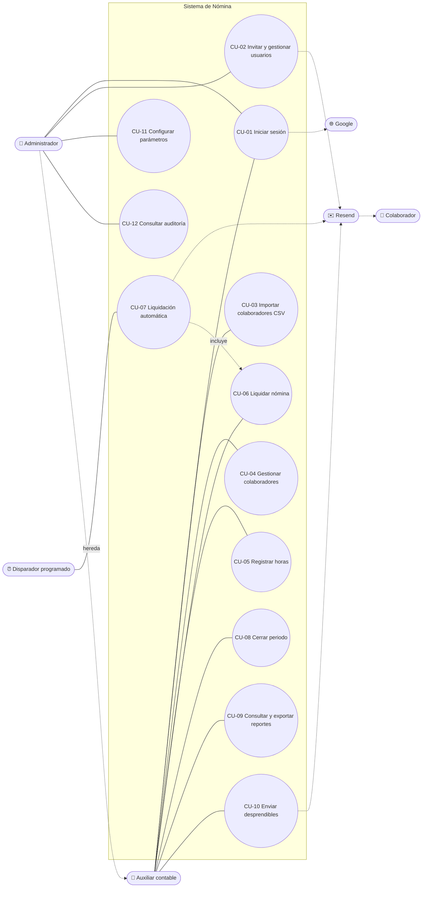
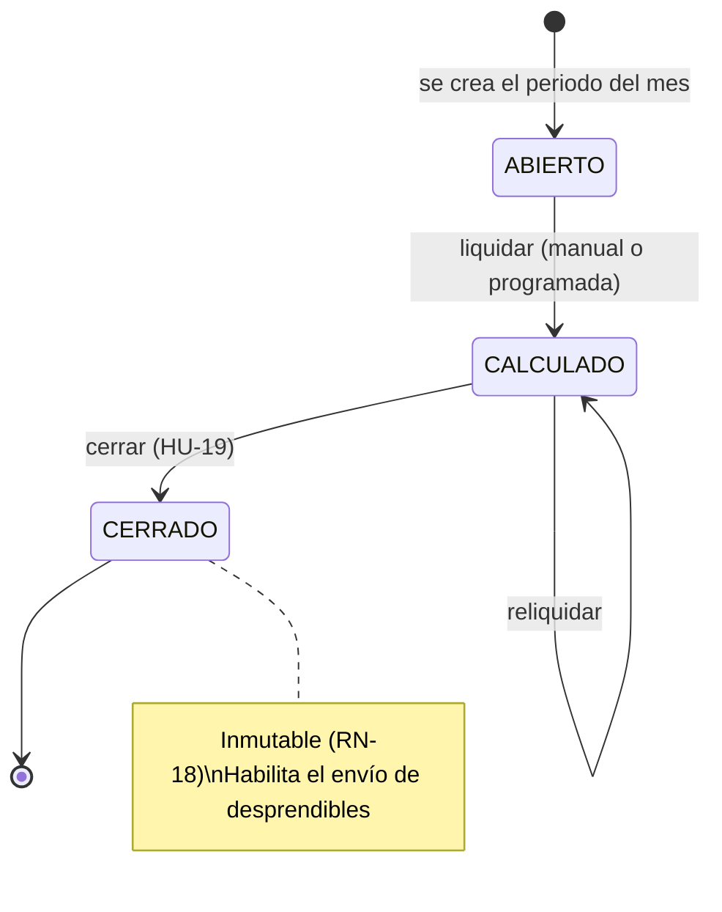

# 06 · Casos de uso

## Actores

| Actor | Tipo | Descripción |
|---|---|---|
| **Administrador** (`ADMIN`) | Primario | Jefe de contabilidad o responsable de TI. Gestiona usuarios, parámetros y auditoría, y puede hacer todo lo que hace el auxiliar contable |
| **Auxiliar contable** (`AUX_CONTABLE`) | Primario | Carga colaboradores y horas, liquida, revisa, cierra y envía desprendibles |
| **Colaborador** | Secundario | No inicia sesión en v1. Recibe su desprendible por correo |
| **Disparador programado** (Supabase pg_cron) | Sistema | Llama a la API todos los días a las 7:00 p. m. (hora de Bogotá) |
| **Google** | Sistema externo | Proveedor de identidad (OAuth 2.0) |
| **Resend** | Sistema externo | Servicio de envío de correos |

## Diagrama de casos de uso

## Especificación de casos de uso principales

### CU-03 · Importar colaboradores desde CSV

| | |
|---|---|
| **Actor** | Auxiliar contable |
| **Historias** | HU-07, HU-08 |
| **Precondición** | Sesión iniciada con rol `AUX_CONTABLE` o `ADMIN` |
| **Postcondición** | Colaboradores válidos creados o actualizados; importación registrada en auditoría |

**Flujo principal**

1. El auxiliar abre *Colaboradores → Importar* y selecciona un archivo CSV.
2. El sistema valida el formato (extensión, tamaño ≤ 5 MB, encabezados).
3. El sistema valida cada fila (RN-19) y muestra una vista previa: N filas válidas y M inválidas, con el error de cada una.
4. El auxiliar confirma la importación.
5. En una sola transacción, el sistema crea los colaboradores nuevos y actualiza los existentes (por email).
6. El sistema muestra el resumen (creados, actualizados, rechazados) y lo registra en auditoría.

**Flujos alternos**

- **2a. Archivo inválido** (no es CSV, supera 5 MB o le faltan encabezados): se rechaza con un mensaje y termina el caso.
- **3a. Hay filas inválidas:** el auxiliar puede descargar el CSV de errores, corregirlo y volver al paso 1, o confirmar solo las filas válidas.
- **5a. Error de base de datos:** se revierte la transacción completa y se informa el error.

---

### CU-06 · Liquidar nómina (manual)

| | |
|---|---|
| **Actor** | Auxiliar contable |
| **Historias** | HU-12 a HU-16, HU-18 |
| **Precondición** | El periodo está ABIERTO o CALCULADO, existen parámetros legales del año y hay colaboradores activos con horas |
| **Postcondición** | Periodo en estado CALCULADO, con una liquidación por colaborador y la ejecución registrada |

**Flujo principal**

1. El auxiliar abre el periodo y elige *Liquidar ahora*.
2. El sistema crea una ejecución con origen MANUAL y estado EN_CURSO.
3. El sistema carga los parámetros del año, el valor hora y la bonificación vigentes en la fecha de corte (RN-16).
4. Para cada colaborador activo con horas registradas, el sistema calcula la liquidación ([algoritmo](../diseno/algoritmo-liquidacion.md)) y la guarda o reemplaza (RN-17).
5. El sistema marca el periodo como CALCULADO y la ejecución como EXITOSA (o CON_ADVERTENCIAS).
6. El sistema muestra el resumen del periodo (CU-09).

**Flujos alternos**

- **3a. No hay parámetros del año:** la ejecución queda FALLIDA con *"No hay parámetros legales para el año AAAA"*.
- **4a. Colaborador sin horas:** se omite y se agrega como advertencia.
- **4b. IBC < SMMLV:** se liquida igual y se agrega la alerta (RN-13).
- **1a. El periodo está CERRADO:** la acción no está disponible (RN-18).

---

### CU-07 · Liquidación automática programada

| | |
|---|---|
| **Actor** | Disparador programado (pg_cron) |
| **Historias** | HU-17, HU-26 |
| **Precondición** | Job configurado en Supabase con el secreto correcto |
| **Postcondición** | Si es día de liquidación, periodo CALCULADO y correo enviado al auxiliar contable |

**Flujo principal**

1. Todos los días a las 00:00 UTC (7:00 p. m. en Bogotá), pg_cron llama a `POST /api/liquidaciones/ejecucion-programada` con la cabecera `X-Cron-Secret`.
2. La API valida el secreto.
3. La API calcula la fecha local de la empresa y verifica si es día de liquidación: día 30, o el último día si el mes tiene menos de 30 días (RN-08).
4. La API obtiene o crea el periodo del mes. Si está ABIERTO, ejecuta el CU-06 con origen PROGRAMADA.
5. La API envía al auxiliar contable un correo con el resultado (HU-26).

**Flujos alternos**

- **2a. Secreto inválido:** responde 401 y no ejecuta nada.
- **3a. No es día de liquidación:** responde 202 sin acción.
- **4a. El periodo ya está CALCULADO o CERRADO:** no hace nada (idempotencia, RN-17).
- **4b. Falla la ejecución:** la ejecución queda FALLIDA y el correo informa el error.

---

### CU-08 · Cerrar periodo

| | |
|---|---|
| **Actor** | Auxiliar contable |
| **Historia** | HU-19 |
| **Precondición** | Periodo CALCULADO |
| **Postcondición** | Periodo CERRADO e inmutable; se habilita el envío de desprendibles |

**Flujo principal**

1. El auxiliar revisa el resumen y elige *Cerrar periodo*.
2. Si hay alertas, el sistema pide confirmar que fueron revisadas.
3. El sistema marca el periodo como CERRADO, registra quién y cuándo, y lo audita.

---

### CU-01 · Iniciar sesión

| | |
|---|---|
| **Actor** | Administrador / Auxiliar contable |
| **Historias** | HU-02, HU-03, HU-05 |
| **Precondición** | La cuenta fue invitada |
| **Postcondición** | Sesión con access token en memoria y refresh token en cookie httpOnly |

**Flujo principal (correo y contraseña)**

1. El usuario ingresa su correo y contraseña.
2. El sistema valida las credenciales y el estado ACTIVO.
3. El sistema emite los tokens y redirige al panel.

**Flujo alterno (Google)**

1. El usuario elige *Continuar con Google* y autoriza el acceso.
2. Google devuelve el perfil.
3. El sistema verifica que el correo esté invitado y emite los tokens.

**Excepciones**

- **Credenciales inválidas:** mensaje genérico.
- **5 intentos fallidos:** bloqueo de 15 minutos.
- **Correo de Google no invitado:** acceso denegado.

## Diagrama de estados del periodo

